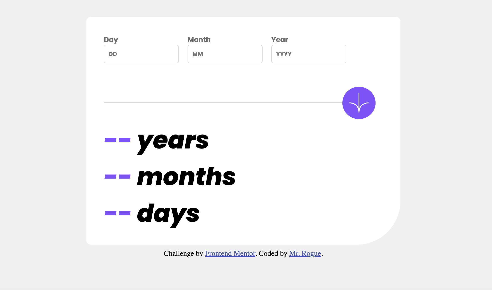

# Frontend Mentor - Age calculator app solution

This is a solution to the [Age calculator app challenge on Frontend Mentor](https://www.frontendmentor.io/challenges/age-calculator-app-dF9DFFpj-Q). Frontend Mentor challenges help you improve your coding skills by building realistic projects.

## Table of contents

- [Overview](#overview)
  - [The challenge](#the-challenge)
  - [Screenshot](#screenshot)
  - [Links](#links)
- [My process](#my-process)
  - [Built with](#built-with)
  - [What I learned](#what-i-learned)
  - [Useful resources](#useful-resources)
- [Author](#author)
- [Acknowledgments](#acknowledgments)


## Overview

### The challenge

Users should be able to:

- View an age in years, months, and days after submitting a valid date through the form
- Receive validation errors if:
  - Any field is empty when the form is submitted
  - The day number is not between 1-31
  - The month number is not between 1-12
  - The year is in the future
  - The date is invalid e.g. 31/04/1991 (there are 30 days in April)
- View the optimal layout for the interface depending on their device's screen size
- See hover and focus states for all interactive elements on the page
- **Bonus**: See the age numbers animate to their final number when the form is submitted

### Screenshot




### Links

- Solution URL: [Add solution URL here](https://github.com/vernonroque/age-calculator.git)
- Live Site URL: [Add live site URL here](https://age-calculator-6066de.netlify.app/)

## My process

### Built with

- Semantic HTML5 markup
- CSS custom properties
- Flexbox
- CSS Grid
- Desktop-first workflow
- [JQuery](https://jquery.com/) - JS library

### What I learned

1. You can't use pseudo elements with self closing tags

A hard lesson I learned while building this project is that I can't use pseudo elements such as `::before` and `::after` with self closing tags. I have to use tags that can hold content.

This was the reason why I couldn't use these pseudo elements with  and <input/>. I had to store them in some div container lke this for <input/> and  respectively:

```html
<div class="day-container">
  <label for="day">Day</label>
  <input class="day" type="text" name="day" placeholder="DD" />
</div>

<span class="img-container"
  ></span>
```

2. Styling pseudo elements

The next tough lesson I learned was learning the best way to style these pseudo elements. I had tried using flexbox and grid. But the problem with those is that the elements would overflow out of its container.

The best way to organize these pseudo elements is by just using `position:relative` and `position:absolute` and then using the attributes left,top, right, bottom. I also used `transform:translateY`
and `transform:translateX` to position the pseudo element. Here is an example:

```css
.img-container {
  position: relative;
  width: 90%;
  margin-top: 10px;
  margin-left: 40px;
}

.img-container::before {
  position: absolute;
  height: 2px;
  content: " ";
  background: hsl(0, 0%, 86%);
  width: 90%;
  left: 0;
  transform: translateY(35px);
}
```

3. Splitting the content of a pseudo element on two lines:
   In order to split the content, I had to do this:

```css
.year-container.error::after {
  content: "Field \A is required";
  white-space: pre; /* Need this line to create line break */
}
```

The `\A` puts the content after it on the next line.
The `white-space: pre` makes sure to count the white spaces as an actual white
space and not ignore it

4. The difference between '==' and '===' equality operators
   I reviewed the difference between these 2 equality operators. The '==' equality operator attempts to convert and compare operands that are of different types.
   For example:

```js
console.log("1" == 1);
//Expected output: true
```

for a '===' strict equality operator, it doesn't convert inputs that are different types. For example:

```js
console.log("1" === 1);
// Expected output: false
```

the strict equality operator always considers operands of different types to be different.

5. I learned about how to handle dates with `new Date()`:

```js
const currentDate = new Date();
///input validation
if (year > currentDate.getFullYear()) validYear = false;
```

I also learned that the method `getFullYear()` will get me the actual year of a date.

6. use fr instead of percentages for widths

Although I took out the grid display out of my design, I learned that it is better to use 'fr' instead of percentages when figuring out the width for columns inside a grid container:

```css
.inner-container {
  display: grid;
  grid-template-columns: 3fr 1fr;
  width: 100%;
}
```

This is better because sometimes when the screen shrinks, the content within a column can exceed the percentage of a width and cause overflow.

### Useful resources

- [Example resource 1](https://developer.mozilla.org/en-US/) - This helped me review some basic concepts and methods
- [Example resource 2](https://chat.openai.com/) - This helped me debug some issues in my code

## Author

- Website - [Vernon Roque](https://developer-portfolio-8cc0c.web.app/)
- Frontend Mentor - [@vernonroque](https://www.frontendmentor.io/profile/vernonroque)
- Github - [@vernonroque](https://github.com/vernonroque)

**Note: Delete this note and add/remove/edit lines above based on what links you'd like to share.**

## Acknowledgments

Thank you universe.
